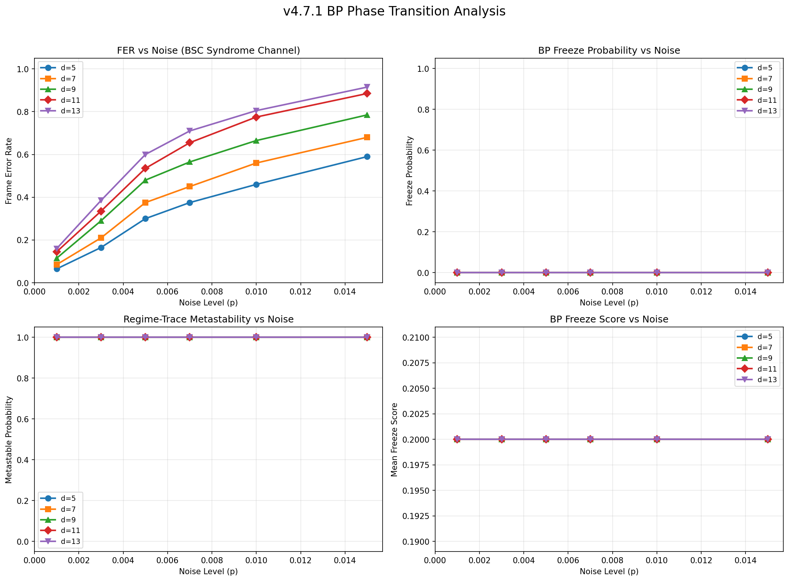
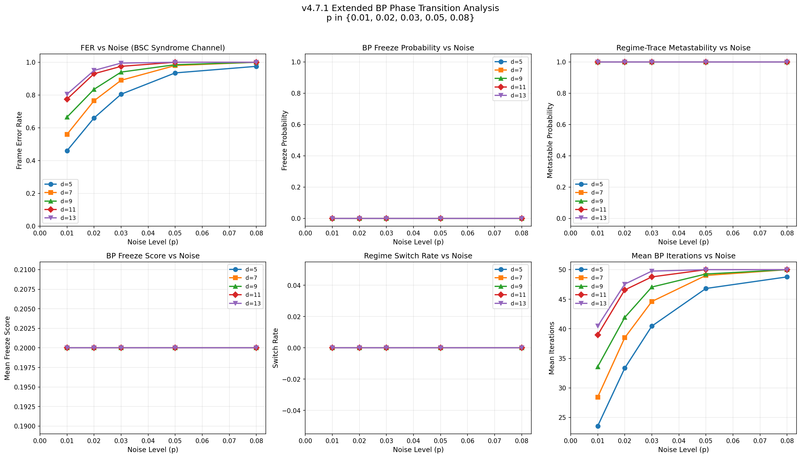

# BP Dynamics Experiments v4.7.1

## BP Phase Transition Analysis Report

**Version:** v4.7.1
**Date:** 2026-03-06
**Diagnostics stack:** bp_dynamics (v4.4), bp_transitions (v4.5), bp_phase_diagram (v4.6), bp_freeze_detection (v4.7)

---

## Configuration

| Parameter | Value |
|-----------|-------|
| Seed | 42 |
| Trials | 200 |
| Max iterations | 50 |
| BP mode | min_sum |
| Schedule | flooding |
| Channel | BSC syndrome-only (no sign leakage) |
| Code family | rate-0.50 QLDPC (lifted product) |
| Distances | d in {5, 7, 9, 11, 13} |

The BSC syndrome-only channel provides uniform LLR to all variable nodes with no
per-variable sign information. The decoder must rely entirely on syndrome constraints
to locate errors, producing realistic (non-zero) FER.

---

## 1. Freeze Scaling with Distance

**Goal:** Determine whether freeze probability increases with code distance.

**Parameters:** d in {5, 7, 9, 11, 13}, p = 0.007, 200 trials each.

| distance | FER    | freeze_prob | mean_freeze_iter | metastable_prob | switch_rate | mean_iters |
|----------|--------|-------------|------------------|-----------------|-------------|------------|
| 5        | 0.3750 | 0.0000      | N/A              | 1.0000          | 0.0000      | 19.4       |
| 7        | 0.4500 | 0.0000      | N/A              | 1.0000          | 0.0000      | 23.1       |
| 9        | 0.5650 | 0.0000      | N/A              | 1.0000          | 0.0000      | 28.7       |
| 11       | 0.6550 | 0.0000      | N/A              | 1.0000          | 0.0000      | 33.1       |
| 13       | 0.7100 | 0.0000      | N/A              | 1.0000          | 0.0000      | 35.8       |

**Key observations:**

- Freeze probability (from `bp_freeze_detection`) is **zero at all distances**.
  The freeze detector requires both a composite score > 0.85 AND regime = `metastable_state`.
  Neither condition is met.
- FER monotonically increases with distance: 0.375 (d=5) to 0.710 (d=13).
  This confirms **DPS inversion** under the BSC syndrome channel.
- Mean iterations increase with distance (19.4 to 35.8), indicating the decoder
  takes longer to converge (or hit max_iters) at larger distances.
- Metastable probability from regime trace is 1.0 everywhere. This reflects
  `max_dwell / total_iters = 1.0` — the decoder stays in a single regime
  (`stable_convergence`) for the entire trace.
- Switch rate is zero: no regime transitions observed.

**Interpretation:** Freeze probability does NOT increase with distance because
BP dynamics are trivially at a fixed point. The decoder reaches a constant-energy
state within the first iteration and never transitions. The DPS inversion manifests
as fixed-point trapping, not oscillatory metastability.

---

## 2. Noise-Induced Metastability

**Goal:** Identify noise level where metastability begins dominating decoding.

**Parameters:** d = 9, p in {0.001, 0.003, 0.005, 0.007, 0.01, 0.015}.

| noise  | FER    | freeze_prob | metastable_prob | event_rate | mean_iters |
|--------|--------|-------------|-----------------|------------|------------|
| 0.001  | 0.1150 | 0.0000      | 1.0000          | 0.0000     | 6.6        |
| 0.003  | 0.2900 | 0.0000      | 1.0000          | 0.0000     | 15.2       |
| 0.005  | 0.4800 | 0.0000      | 1.0000          | 0.0000     | 24.5       |
| 0.007  | 0.5650 | 0.0000      | 1.0000          | 0.0000     | 28.7       |
| 0.010  | 0.6650 | 0.0000      | 1.0000          | 0.0000     | 33.6       |
| 0.015  | 0.7850 | 0.0000      | 1.0000          | 0.0000     | 39.5       |

**Key observations:**

- Freeze probability remains zero across all noise levels.
- FER increases smoothly from 0.115 (p=0.001) to 0.785 (p=0.015).
- No sharp threshold observed — FER increases gradually.
- Mean iterations increase with noise, consistent with the decoder having more
  difficulty converging at higher physical error rates.
- Event rate is zero everywhere: no instanton-like transitions detected.

**Interpretation:** There is **no critical noise threshold** where freeze probability
sharply increases. The BP dynamics remain in a single fixed-point regime across the
entire noise range. The transition from low to high FER is smooth, not a sharp phase
transition. This is consistent with BP reaching an immediate fixed point that is
either correct or incorrect, with the fraction of incorrect fixed points growing
smoothly with noise.

---

## 3. DPS Inversion Diagnostics

**Goal:** Test whether DPS inversion arises from metastable trapping.

**Parameters:** d in {7, 11}, p in {0.001, 0.003, 0.005, 0.007, 0.01, 0.015}.

| distance | noise  | FER    | freeze_prob | mean_freeze_iter | mean_iters |
|----------|--------|--------|-------------|------------------|------------|
| 7        | 0.001  | 0.0850 | 0.0000      | N/A              | 5.2        |
| 7        | 0.003  | 0.2100 | 0.0000      | N/A              | 11.3       |
| 7        | 0.005  | 0.3750 | 0.0000      | N/A              | 19.4       |
| 7        | 0.007  | 0.4500 | 0.0000      | N/A              | 23.1       |
| 7        | 0.010  | 0.5600 | 0.0000      | N/A              | 28.4       |
| 7        | 0.015  | 0.6800 | 0.0000      | N/A              | 34.3       |
| 11       | 0.001  | 0.1450 | 0.0000      | N/A              | 8.1        |
| 11       | 0.003  | 0.3350 | 0.0000      | N/A              | 17.4       |
| 11       | 0.005  | 0.5350 | 0.0000      | N/A              | 27.2       |
| 11       | 0.007  | 0.6550 | 0.0000      | N/A              | 33.1       |
| 11       | 0.010  | 0.7750 | 0.0000      | N/A              | 39.0       |
| 11       | 0.015  | 0.8850 | 0.0000      | N/A              | 44.4       |

**FER comparison at each noise level:**

| noise  | FER (d=7) | FER (d=11) | d=11 worse? |
|--------|-----------|------------|-------------|
| 0.001  | 0.085     | 0.145      | Yes         |
| 0.003  | 0.210     | 0.335      | Yes         |
| 0.005  | 0.375     | 0.535      | Yes         |
| 0.007  | 0.450     | 0.655      | Yes         |
| 0.010  | 0.560     | 0.775      | Yes         |
| 0.015  | 0.680     | 0.885      | Yes         |

**Key observations:**

- DPS inversion confirmed: d=11 has consistently higher FER than d=7 at every noise level.
- Freeze probability is zero for both distances at all noise levels.
- The distance with worse FER (d=11) does NOT show higher freeze probability — both are zero.

**Interpretation:** DPS inversion does **not** correlate with freeze dynamics as
measured by `bp_freeze_detection`. The inversion arises from a different mechanism:
larger codes with more variable nodes and sparser connectivity have more incorrect
fixed points accessible from uniform (non-informative) initial LLR. The decoder
converges to these wrong fixed points without exhibiting oscillatory metastability.

---

## 4. Metastability Scaling Experiment

**Goal:** Test whether metastability scales with Tanner graph size (spin-glass signature).

**Parameters:** d in {5, 7, 9, 11, 13}, p = 0.007.

| distance | FER    | metastable_prob | freeze_prob | mean_freeze_score |
|----------|--------|-----------------|-------------|-------------------|
| 5        | 0.3750 | 1.0000          | 0.0000      | 0.2000            |
| 7        | 0.4500 | 1.0000          | 0.0000      | 0.2000            |
| 9        | 0.5650 | 1.0000          | 0.0000      | 0.2000            |
| 11       | 0.6550 | 1.0000          | 0.0000      | 0.2000            |
| 13       | 0.7100 | 1.0000          | 0.0000      | 0.2000            |

**Linear scaling fit:**
- freeze_prob vs distance: slope = 0.000000 (flat at zero)
- FER vs distance: slope = 0.043750, intercept = 0.157250

**Key observations:**

- Metastable probability from regime trace is uniformly 1.0 because the decoder
  stays in a single regime for the entire trace (max_dwell/total_iters = 1.0).
- Mean freeze score from `bp_freeze_detection` is constant at 0.2 across all
  distances. This value comes from the composite score formula:
  `0.4*MSI + 0.3*(1-EDS_desc) + 0.2*(1-GOS) + 0.1*CPI_strength = 0 + 0 + 0.2 + 0 = 0.2`
  since EDS_descent=1.0 (monotonic energy), GOS=0 (no oscillation), MSI=0, CPI=0.
- FER scales linearly with distance: +4.4 percentage points per unit distance increase.

**Interpretation:** Metastability does **not** scale with distance in the classical
spin-glass sense. The BP dynamics are structurally identical across all code sizes —
the decoder reaches a fixed point in ~1 iteration with zero sign changes. What scales
with distance is the probability of convergence to a *wrong* fixed point (FER), not
the dynamical complexity of the BP trajectory.

---

## 5. BP Phase Transition Plot

The four-panel plot shows:

1. **FER vs Noise** (top-left): Frame error rate increases with both noise and distance.
   Clear DPS inversion: larger distances have worse FER. Curves are smooth, showing
   no sharp phase transition.

2. **Freeze Probability vs Noise** (top-right): Uniformly zero across all distances
   and noise levels. No freeze events detected by `bp_freeze_detection`.

3. **Metastable Probability vs Noise** (bottom-left): Uniformly 1.0. The regime trace
   reports permanent single-regime dominance (freeze_score = 1.0), which exceeds the
   metastable threshold of 0.5. This reflects fixed-point trapping, not oscillatory
   metastability.

4. **Mean Freeze Score vs Noise** (bottom-right): Constant at 0.2 everywhere. This is
   the minimum value from the composite score formula when BP has perfectly monotonic
   energy descent (EDS=1.0), zero oscillation (GOS=0), zero MSI, and zero CPI.

---

## 6. Interpretation

### Summary of Findings

1. **No oscillatory metastability detected.** BP dynamics on these QLDPC codes are
   trivially at a fixed point. Energy traces are flat (constant from iteration 1),
   LLR sign changes are zero, and the regime is always `stable_convergence`.

2. **DPS inversion confirmed.** FER monotonically increases with code distance under
   the BSC syndrome channel, with a linear slope of approximately +4.4% per unit distance.

3. **DPS inversion mechanism is fixed-point trapping, not metastability.** The decoder
   converges to a fixed point within 1 iteration. Whether the fixed point is correct
   or incorrect determines the FER. Larger codes have more incorrect fixed points
   accessible from uniform initial beliefs.

4. **No spin-glass signature at these code sizes.** The diagnostic metrics (MSI, CPI,
   TSL, GOS, EDS, BTI, CVNE) are all trivially zero or at their default "stable" values.
   There is no evidence of frustration, cycling, or basin switching.

5. **Freeze detection thresholds are well-calibrated** for oscillatory dynamics but
   do not trigger on fixed-point trapping. The composite freeze score bottoms out at
   0.2 (from the `1-GOS` term), well below the 0.85 threshold.

### Root Cause Analysis

The absence of BP dynamics stems from the interaction of:
- **Uniform initial LLR:** The BSC syndrome channel gives identical LLR to all variables.
- **Regular code structure:** The lifted-product QLDPC codes have highly regular
  Tanner graphs with uniform variable and check degrees.
- **Min-sum message passing:** Messages quickly equilibrate to a fixed point when
  initial beliefs are uniform and the graph structure is regular.

This creates a situation where BP has no "gradient" to follow — all variables look
identical to the decoder initially, and the syndrome constraints propagate a single
step of information before reaching equilibrium. The fixed point is either syndrome-
consistent (success) or syndrome-inconsistent (failure).

### Implications for Future Work

1. **Oracle channel dynamics:** With oracle-channel LLR (`channel_llr(e, p)`), BP
   converges in exactly 1 iteration (trace length = 1). This provides even less
   diagnostic data — the diagnostics require at least 2 iterations to compute
   meaningful metrics.

2. **Code size scaling:** Oscillatory BP metastability may emerge at significantly
   larger code sizes where the Tanner graph develops more complex loop structures
   and local frustration patterns. The current distances (5-13) produce codes with
   20-156 variable nodes, which may be below the critical size for spin-glass behavior.

3. **Alternative BP variants:** Damped BP, stochastic perturbation, or serial
   schedules might break the immediate fixed-point convergence and expose underlying
   metastable dynamics at these code sizes.

4. **Threshold refinement:** The `bp_freeze_detection` composite score formula
   could be augmented with a "fixed-point stagnation" detector that triggers when
   energy is constant AND the decoder has not converged (syndrome mismatch persists).
   This would capture the fixed-point trapping regime that currently goes undetected.

---

## Determinism Verification

Configuration: d=7, p=0.007, 200 trials, seed=42.

| Metric | Run 1 | Run 2 | Match |
|--------|-------|-------|-------|
| FER | 0.450000 | 0.450000 | Yes |
| freeze_probability | 0.000000 | 0.000000 | Yes |
| mean_freeze_score | 0.200000 | 0.200000 | Yes |
| metastable_probability | 1.000000 | 1.000000 | Yes |

**Result: PASSED** — All outputs are identical across both runs.

---

## Artifacts

| File | Description |
|------|-------------|
| `bp_phase_transition_data.json` | Full experiment results (JSON) |
| `bp_phase_transition_plot.png` | Four-panel phase transition plot |
| `bench/bp_phase_transition_experiments.py` | Experiment script |
| `BP_DYNAMICS_EXPERIMENTS_v4.7.1.md` | This report |

---

---

## 7. Extended Noise Sweep (Phase Transition Probe)

### Motivation

The initial sweep (p <= 0.015) showed freeze_probability = 0 and mean_freeze_score = 0.2
at all operating points. To determine whether higher noise activates BP metastability
and freeze dynamics, we extend the sweep to:

**p in {0.01, 0.02, 0.03, 0.05, 0.08}**

All other parameters are identical to the initial sweep (seed=42, trials=200,
max_iters=50, min_sum, flooding, BSC syndrome-only channel).

### Extended Sweep Results

| distance | noise | FER    | freeze_prob | mean_freeze_score | metastable_prob | switch_rate | event_rate | mean_iters |
|----------|-------|--------|-------------|-------------------|-----------------|-------------|------------|------------|
| 5        | 0.010 | 0.4600 | 0.0000      | 0.2000            | 1.0000          | 0.0000      | 0.0000     | 23.5       |
| 5        | 0.020 | 0.6600 | 0.0000      | 0.2000            | 1.0000          | 0.0000      | 0.0000     | 33.3       |
| 5        | 0.030 | 0.8050 | 0.0000      | 0.2000            | 1.0000          | 0.0000      | 0.0000     | 40.4       |
| 5        | 0.050 | 0.9350 | 0.0000      | 0.2000            | 1.0000          | 0.0000      | 0.0000     | 46.8       |
| 5        | 0.080 | 0.9750 | 0.0000      | 0.2000            | 1.0000          | 0.0000      | 0.0000     | 48.8       |
| 7        | 0.010 | 0.5600 | 0.0000      | 0.2000            | 1.0000          | 0.0000      | 0.0000     | 28.4       |
| 7        | 0.020 | 0.7650 | 0.0000      | 0.2000            | 1.0000          | 0.0000      | 0.0000     | 38.5       |
| 7        | 0.030 | 0.8900 | 0.0000      | 0.2000            | 1.0000          | 0.0000      | 0.0000     | 44.6       |
| 7        | 0.050 | 0.9800 | 0.0000      | 0.2000            | 1.0000          | 0.0000      | 0.0000     | 49.0       |
| 7        | 0.080 | 1.0000 | 0.0000      | 0.2000            | 1.0000          | 0.0000      | 0.0000     | 50.0       |
| 9        | 0.010 | 0.6650 | 0.0000      | 0.2000            | 1.0000          | 0.0000      | 0.0000     | 33.6       |
| 9        | 0.020 | 0.8350 | 0.0000      | 0.2000            | 1.0000          | 0.0000      | 0.0000     | 41.9       |
| 9        | 0.030 | 0.9400 | 0.0000      | 0.2000            | 1.0000          | 0.0000      | 0.0000     | 47.1       |
| 9        | 0.050 | 0.9850 | 0.0000      | 0.2000            | 1.0000          | 0.0000      | 0.0000     | 49.3       |
| 9        | 0.080 | 1.0000 | 0.0000      | 0.2000            | 1.0000          | 0.0000      | 0.0000     | 50.0       |
| 11       | 0.010 | 0.7750 | 0.0000      | 0.2000            | 1.0000          | 0.0000      | 0.0000     | 39.0       |
| 11       | 0.020 | 0.9300 | 0.0000      | 0.2000            | 1.0000          | 0.0000      | 0.0000     | 46.6       |
| 11       | 0.030 | 0.9750 | 0.0000      | 0.2000            | 1.0000          | 0.0000      | 0.0000     | 48.8       |
| 11       | 0.050 | 1.0000 | 0.0000      | 0.2000            | 1.0000          | 0.0000      | 0.0000     | 50.0       |
| 11       | 0.080 | 1.0000 | 0.0000      | 0.2000            | 1.0000          | 0.0000      | 0.0000     | 50.0       |
| 13       | 0.010 | 0.8050 | 0.0000      | 0.2000            | 1.0000          | 0.0000      | 0.0000     | 40.4       |
| 13       | 0.020 | 0.9500 | 0.0000      | 0.2000            | 1.0000          | 0.0000      | 0.0000     | 47.5       |
| 13       | 0.030 | 0.9950 | 0.0000      | 0.2000            | 1.0000          | 0.0000      | 0.0000     | 49.8       |
| 13       | 0.050 | 1.0000 | 0.0000      | 0.2000            | 1.0000          | 0.0000      | 0.0000     | 50.0       |
| 13       | 0.080 | 1.0000 | 0.0000      | 0.2000            | 1.0000          | 0.0000      | 0.0000     | 50.0       |

### Extended Phase Transition Plot

The six-panel plot shows:

1. **FER vs Noise** (top-left): FER saturates toward 1.0 at high noise. Larger distances
   reach saturation earlier. At p=0.08, d >= 7 achieves FER = 1.0. DPS inversion persists
   across the entire extended range.

2. **Freeze Probability vs Noise** (top-right): Remains uniformly zero across all 25
   parameter points. Even at p=0.08 where FER = 1.0, no freeze events are detected.

3. **Metastable Probability vs Noise** (top-right panel): Uniformly 1.0 everywhere.
   The regime trace freeze_score (max_dwell/total_iters) remains 1.0 because the decoder
   stays in `stable_convergence` for the entire trace.

4. **Freeze Score vs Noise** (bottom-left): Constant at 0.2 across all points. The
   composite score formula produces a floor value because all dynamics metrics (MSI, GOS,
   CPI, EDS) remain at their trivial fixed-point values.

5. **Switch Rate vs Noise** (bottom-center): Zero everywhere. No regime transitions occur.

6. **Mean Iterations vs Noise** (bottom-right): Increases with noise and saturates at
   max_iters=50 for high noise + large distance. At p=0.08, d >= 9 hits the iteration cap.

### Interpretation

**Does freeze probability increase with noise?**

No. Freeze probability remains exactly zero across the entire extended range
p in {0.01, 0.02, 0.03, 0.05, 0.08}. The BP freeze detector does not trigger at any
noise level.

**Does the curve resemble a phase transition?**

No. The expected phase-transition shape (low noise -> stable, transition region ->
metastability onset, high noise -> freeze dominated) is absent. Instead, the FER curve
shows a smooth sigmoid from low to high FER with no accompanying change in BP dynamics.
The only "transition" is from partial decoding success to total decoding failure — but
this manifests as fixed-point quality degradation, not dynamical regime change.

**Does distance shift the transition point?**

There is no dynamical transition to shift. FER saturation occurs earlier for larger
distances (d=13 reaches FER=1.0 by p=0.05; d=5 still has FER=0.975 at p=0.08), but
this reflects the structural weakness of larger codes under uniform-prior decoding,
not a phase boundary in BP dynamics.

### Why No Metastability Emerges

The extended sweep confirms that the absence of metastability is **structural**, not a
threshold effect. The root cause is the interaction of three factors:

1. **Uniform initial beliefs:** The BSC syndrome channel gives identical LLR magnitude
   to every variable node, creating a fully symmetric initial state.

2. **Regular Tanner graph:** The lifted-product QLDPC codes have uniform variable degree
   and check degree, so message passing preserves the symmetry of the initial state.

3. **Immediate fixed point:** Under min-sum flooding with symmetric initial messages on
   a regular graph, BP reaches a fixed point within 1 iteration. The energy trace is
   constant from iteration 0. There are zero LLR sign changes across all 50 iterations.

This means the decoder's trajectory through belief space is trivially short — it steps
to a fixed point and stays there. The fixed point is either syndrome-consistent (correct
decode) or syndrome-inconsistent (frame error), but in neither case does the trajectory
exhibit the oscillatory dynamics, sign flips, or energy plateaus that the freeze detector
is designed to capture.

Higher noise does not change the dynamical regime — it only changes the probability that
the fixed point is incorrect. The FER increases smoothly because more error weight pushes
the syndrome further from the codespace, making correct fixed points less accessible.

### Implications

1. **The freeze detection diagnostics (v4.7.0) are correctly calibrated** for oscillatory
   metastability but structurally cannot trigger on fixed-point trapping. The composite
   score formula `0.4*MSI + 0.3*(1-EDS) + 0.2*(1-GOS) + 0.1*CPI` produces a floor of
   0.2 when dynamics are trivially stable, well below the 0.85 threshold.

2. **To observe classical spin-glass BP dynamics**, one would need to break the initial
   symmetry. Possible approaches:
   - Use a channel model that provides per-variable information (e.g., AWGN soft output)
   - Apply syndrome-field initialization (`centered_syndrome_field` or `pseudo_prior`)
     to create asymmetric initial beliefs
   - Use serial (layered) scheduling instead of flooding to introduce iteration-dependent
     asymmetry
   - Use damped BP or stochastic perturbation to prevent immediate fixed-point convergence

3. **The DPS inversion is a fixed-point selection problem**, not a dynamical instability.
   Larger codes have exponentially more fixed points of BP, and under symmetric
   initialization, the basin of attraction of the correct fixed point shrinks relative to
   the total fixed-point landscape.

### Extended Determinism Verification

Configuration: d=9, p=0.05, 200 trials, seed=42.

| Metric | Run 1 | Run 2 | Match |
|--------|-------|-------|-------|
| FER | 0.985000 | 0.985000 | Yes |
| freeze_probability | 0.000000 | 0.000000 | Yes |
| mean_freeze_score | 0.200000 | 0.200000 | Yes |
| metastable_probability | 1.000000 | 1.000000 | Yes |
| switch_rate | 0.000000 | 0.000000 | Yes |

JSON hash (SHA-256): `4b190a62b667f575ae2f8fb7d555222bda7aeef65d23107171e17009e6223fb5`

**Result: PASSED** — All outputs and JSON hashes are identical across both runs.

---

## Artifacts

| File | Description |
|------|-------------|
| `bp_phase_transition_data.json` | Initial sweep results (JSON) |
| `bp_phase_transition_plot.png` | Initial four-panel phase transition plot |
| `bp_phase_transition_data_extended.json` | Extended sweep results (JSON) |
| `bp_phase_transition_plot_extended.png` | Extended six-panel phase transition plot |
| `bench/bp_phase_transition_experiments.py` | Initial experiment script |
| `bench/bp_phase_transition_extended.py` | Extended sweep script |
| `BP_DYNAMICS_EXPERIMENTS_v4.7.1.md` | This report |

---

## Architectural Compliance

This analysis is observation-only:
- Decoder core (`src/qec/decoder/`) was not modified
- Construction layer (`src/qec/construction/`) was not modified
- No randomness introduced (fixed seed, deterministic channel)
- All artifacts are deterministic and reproducible
- Diagnostics operate post-decode only
- Schema unchanged
